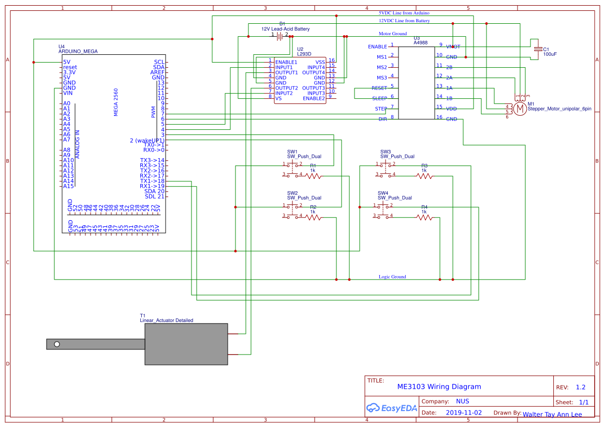
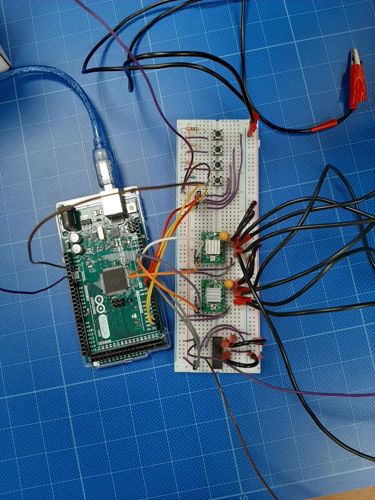

# Automated Mobile Gangway
The goal of this project is to build an automated, mobile, battery-powered gangway that would allow persons to safely cross the gap between a wharf and a vessel. My role in this project is to provide an end-to-end design for the controls of the gangway.

In this repository, you will find:
1. Arduino code ("me3103_2.ino")
2. Wiring schematic ("wiring_schematic.pdf")
3. Design considerations and documentation in markdown and pdf ("amg_documentation.md")

# Wiring
Note: We used 2 stepper motor drivers instead of 1 to power the stepper motor due to overheating from using only one (i.e. we distributed the current load across 2 drivers)

# Acknowledgements
This project would not have been possible without my groupmates (who helped with fabrication, CAD design, purchasing, and more):
1. Tanay Rishi
2. Ryan
3. Siang Kiat
4. Joel
5. Sam

