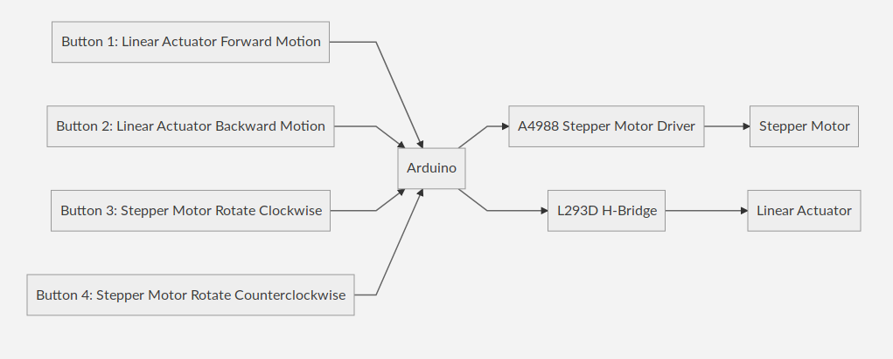

# ME3103 Project Controls
This document aims to describe how the controls of the linear actuator and stepper motor will be carried out.

# Changelog
# 191112
## Notes
Today, we are going to test the dual driver setup in light of how difficult it is to set the current limit for the TB67S. If that doesn't work, we will:
1. Resolder the TB67S
2. Try to set the current limit again

## New Code
```Arduino
//LINEAR ACTUATOR
//Define interrupt pins for Linear Actuator
#define button1 2
#define button2 3

//Linear Actuator Settings
#define motorPin1 4
#define motorPin2 5

//STEPPER MOTOR
// Define interrupt pins for stepper motor
# define button3 18
# define button4 19

//SM Driver 1 settings
#define dirPin1 6
#define stepPin1 7

//SM Driver 2 settings
#define dirPin2 8
#define stepPin2 9

//SM Universal settings
#define stepsPerRevolution 10
#define stepDelay 15000
#define stepDelay2 5000 //This test delay is for stepPin Low, which allows the stepping to change quickly

//Interrupt duration
#define interrupt_duration 200

volatile int mode = 3;

//This will run only one time.
void setup(){
//LINEAR ACTUATOR
  //Set linear actuator interrupt pins as input
  pinMode(button1, INPUT);
  pinMode(button2, INPUT);
  
  //Set up interrupts
  attachInterrupt(digitalPinToInterrupt(button1), forward, CHANGE);
  attachInterrupt(digitalPinToInterrupt(button2), backward, CHANGE);

  //Set pins as outputs
  pinMode(motorPin1, OUTPUT);
  pinMode(motorPin2, OUTPUT);

//STEPPER MOTOR
  // Declare stepper motor pins as output:
  pinMode(stepPin1, OUTPUT);
  pinMode(dirPin1, OUTPUT);
  pinMode(stepPin2, OUTPUT);
  pinMode(dirPin2, OUTPUT);
    
  //Enable interrupt pins as input
  pinMode(button3, INPUT);
  pinMode(button4, INPUT);
  
  //Set up interrupt pins as interrupts
  attachInterrupt(digitalPinToInterrupt(button3), clockwise, CHANGE);
  attachInterrupt(digitalPinToInterrupt(button4), anticlockwise, CHANGE);

  //Enable serial monitor
  Serial.begin(9600);
  
}


void loop(){
  /*
   * Mode 1 = LA Forward
   * Mode 2 = LA Backward
   * Mode 3 = LA Stop
   * Mode 4 = SM Clockwise
   * Mode 5 = SM Anticlockwise
    */

   switch(mode){
    case 1:
      analogWrite(motorPin1, 255);
      analogWrite(motorPin2, 0);
      //delay(5000);
      break;
    case 2:
      analogWrite(motorPin1, 0);
      analogWrite(motorPin2, 255);
      //delay(5000);
      break;
    case 3:
      analogWrite(motorPin1, 0);
      analogWrite(motorPin2, 0);
      //delay(5000);
      break;
    case 4:
      // Set the spinning direction clockwise:
      digitalWrite(dirPin1, HIGH);
      digitalWrite(dirPin2, HIGH);
      // Spin the stepper motor 5 revolutions fast:
      for (int i = 0; i < stepsPerRevolution; i++) {
        // These four lines result in 1 step:
        digitalWrite(stepPin1, HIGH);
        digitalWrite(stepPin2, HIGH);
        delayMicroseconds(stepDelay);
        digitalWrite(stepPin1, LOW);
        digitalWrite(stepPin2, LOW);
        delayMicroseconds(stepDelay);
      }
      break;
    case 5:
      // Set the spinning direction counterclockwise:
      digitalWrite(dirPin1, LOW);
      digitalWrite(dirPin2, LOW);
      //Spin the stepper motor 5 revolutions fast:
      for (int i = 0; i < stepsPerRevolution; i++) {
        // These four lines result in 1 step:
        digitalWrite(stepPin1, HIGH);
        digitalWrite(stepPin2, HIGH);
        delayMicroseconds(stepDelay);
        digitalWrite(stepPin1, LOW);
        digitalWrite(stepPin2, LOW);
        delayMicroseconds(stepDelay);
      }
      break;
   }
  
}


void forward(){
  static unsigned long last_interrupt_time = 0;
  unsigned long interrupt_time = millis();
  // If interrupts come faster than 200ms, assume it's a bounce and ignore
  if (interrupt_time - last_interrupt_time > interrupt_duration)
  {
    delay(350);
    int stateButton = digitalRead(button1);
    //Serial.print(stateButton);
    //Serial.print("\n");
    switch(stateButton){
      case 0:
        mode = 3;
        Serial.print("BUTTON 1 RELEASED");
        Serial.print("\n");
        break;
      case 1:
        mode = 1;
        Serial.print("BUTTON 1 PRESSED");
        Serial.print("\n");
        break;
    }
  }
  last_interrupt_time = interrupt_time;
}

void backward(){
  static unsigned long last_interrupt_time = 0;
  unsigned long interrupt_time = millis();
  // If interrupts come faster than 200ms, assume it's a bounce and ignore
  if (interrupt_time - last_interrupt_time > interrupt_duration)
  {
    delay(350);
    int stateButton = digitalRead(button2);
    switch(stateButton){
      case 0:
        mode = 3;
        Serial.print("BUTTON 2 RELEASED");
        Serial.print("\n");
        break;
      case 1:
        mode = 2;
        Serial.print("BUTTON 2 PRESSED");
        Serial.print("\n");
        break;
    }
  }
  last_interrupt_time = interrupt_time;
}


void clockwise(){
  static unsigned long last_interrupt_time = 0;
  unsigned long interrupt_time = millis();
  // If interrupts come faster than 200ms, assume it's a bounce and ignore
  if (interrupt_time - last_interrupt_time > interrupt_duration)
  {
    delay(350);
    int stateButton = digitalRead(button3);
    //Serial.print(stateButton);
    //Serial.print("\n");
    switch(stateButton){
      case 0:
        mode = 3;
        Serial.print("BUTTON 3 RELEASED");
        Serial.print("\n");
        break;
      case 1:
        mode = 4;
        Serial.print("BUTTON 3 PRESSED");
        Serial.print("\n");
        break;
    }
  }
  last_interrupt_time = interrupt_time;
}

void anticlockwise(){
  static unsigned long last_interrupt_time = 0;
  unsigned long interrupt_time = millis();
  // If interrupts come faster than 200ms, assume it's a bounce and ignore
  if (interrupt_time - last_interrupt_time > interrupt_duration)
  {
    delay(350);
    int stateButton = digitalRead(button4);
    switch(stateButton){
      case 0:
        mode = 3;
        Serial.print("BUTTON 4 RELEASED");
        Serial.print("\n");
        break;
      case 1:
        mode = 5;
        Serial.print("BUTTON 4 PRESSED");
        Serial.print("\n");
        break;
    }
  }
  last_interrupt_time = interrupt_time;
}
```

# 191111
## Setting current limit
Current limit =  VREF x 1.56
Given current limit = 2A
VREF = 2 / 1.56 = 1.28V

## Q&A on current limit adjustment for motor drivers
https://forum.arduino.cc/index.php?topic=415724.0


# 191109
## Stepper motor driver replacement: TB67S128FTG Stepper Motor Driver
Website: https://www.pololu.com/product/2998

## Minimal Wiring Diagram


## Major Important Changes To Note
- Stepper motor center taps are left disconnected. This allows us to control the stepper motor in bipolar mode using the driver instead of unipolar mode. In theory, this should provide more torque

## Power connections
The driver requires a motor supply voltage of 6.5 V to 44 V to be connected across VIN and GND. This supply should be capable of delivering the expected stepper motor current.

A 5 V output from the TB67S128FTG’s internal regulator is made available on the VCC pin. This output can supply up to 5 mA to external loads, and it can optionally be used to supply the neighboring IOREF pin.

## Current limiting
To achieve high step rates, the motor supply is typically higher than would be permissible without active current limiting. For instance, a typical stepper motor might have a maximum current rating of 1 A with a 5 Ω coil resistance, which would indicate a maximum motor supply of 5 V. Using such a motor with 10 V would allow higher step rates, but the current must actively be limited to under 1 A to prevent damage to the motor.

The TB67S128FTG supports such active current limiting, and the trimmer potentiometer on the board can be used to set the current limit:

You will typically want to set the driver’s current limit to be at or below the current rating of your stepper motor. One way to set the current limit is to put the driver into full-step mode and to measure the current running through a single motor coil without clocking the STEP input. The measured current will be equal to the current limit (since both coils are always on and limited to 100% of the current limit setting in full-step mode).

Another way to set the current limit is to measure the VREF voltage and calculate the resulting current limit. The VREF voltage is accessible on the VREF pin. The driver’s RS_SEL and GAIN_SEL pins are pulled low by default, selecting internal current sensing and making the current limit relate to VREF as follows:
```
current limit=VREF×1.56 AV (GAIN_SEL = L)
```
So, for example, if you have a stepper motor rated for 1 A you can set the current limit to 1 A by setting the reference voltage to about 0.64 V.

If the GAIN_SEL pin is high, the VREF gain (multiplier) is reduced by half, and the relationship between the current limit and VREF instead becomes:
```
current limit=VREF×0.78 AV (GAIN_SEL = H)
```
Alternatively, the driver can measure motor current with external sense resistors instead of using internal current sensing. To use external sensing, cut the connections between the RS_A and RS_B pins and the adjacent GND pins, connect appropriate resistors between each RS pin and GND, and drive the RS_SEL pin high. See the TB67S128FTG datasheet for information about setting the current limit in this mode.

Note: The coil current can be very different from the power supply current, so you should not use the current measured at the power supply to set the current limit. The appropriate place to put your current meter is in series with one of your stepper motor coils. If the driver is in full-step mode, both coils will always be on and limited to 100% of the current limit setting (unlike some other drivers that limit it to about 70% in full-step mode). If your driver is in one of the microstepping modes, the current through the coils will change with each step, ranging from 0% to 100% of the set limit. If Active Gain Control is active, it will also further reduce the actual motor current. See the driver’s datasheet for more information.

The TB67S128FTG also features three inputs (TORQE0, TORQE1, and TORQE2) that can be used for digital control of the current limit, applying a multiplier between 10% and 100% (the default) to the current limit set by the VREF voltage. See the driver’s datasheet for details about these pins and their available settings.


## Q&A
### I want to control a 3.9 V, 600 mA bipolar stepper motor like this. Do I need to use a low-voltage stepper motor driver like the DRV8834 or STSPIN220, since your other stepper motor drivers have minimum operating voltages above 3.9 V?
No, this driver is not your only option. To avoid damaging your stepper motor, you want to avoid exceeding the rated current, which is 600 mA in this instance. All of our stepper motor drivers let you limit the maximum current, so as long as you set the limit below the rated current, you will be within spec for your motor, even if the voltage exceeds the rated voltage. (In other words, driving a 3.9 V motor with a DRV8825, and using a supply voltage higher than the DRV8825’s minimum of 8.2 V, will not damage the motor as long as the current limit is set appropriately.)

The voltage rating is just the voltage at which each coil draws the rated current, so the coils of your stepper motor will draw 600 mA at 3.9 V. By using a higher voltage along with active current limiting, the current is able to ramp up faster, which lets you achieve higher step rates than you could using the rated voltage.

However, if you still want to use a lower motor supply voltage (under 8 V) for other reasons, the DRV8834 or STSPIN220 are appropriate drivers to use.


## 191108
1. New idea: Using two stepper motor drivers to power 1 stepper motor
  - Set both to current limit of 1A (since A4988 can only operate continuously at 1A)
    - For current limit of 1A, Vref should be 540mV
  - Connect 100uF capacitors between VMOT and GND for each A4988
    - Wiring schematic has been updated to reflect this change
2. Replace power lines with better wires
  - Soldered new wires with header pins
3. New code for controlling stepper motor with 2 drivers
```Arduino
//LINEAR ACTUATOR
//Define interrupt pins for Linear Actuator
#define button1 2
#define button2 3

//Linear Actuator Settings
#define motorPin1 4
#define motorPin2 5

//STEPPER MOTOR
// Define interrupt pins for stepper motor
# define button3 18
# define button4 19

//SM Driver 1 settings
#define dirPin1 6
#define stepPin1 7

//SM Driver 2 settings
#define dirPin2 8
#define stepPin2 9

//SM Universal settings
#define stepsPerRevolution 5  
#define stepDelay 1000

//Interrupt duration
#define interrupt_duration 200

volatile int mode = 3;

//This will run only one time.
void setup(){
//LINEAR ACTUATOR
  //Set linear actuator interrupt pins as input
  pinMode(button1, INPUT);
  pinMode(button2, INPUT);
  
  //Set up interrupts
  attachInterrupt(digitalPinToInterrupt(button1), forward, CHANGE);
  attachInterrupt(digitalPinToInterrupt(button2), backward, CHANGE);

  //Set pins as outputs
  pinMode(motorPin1, OUTPUT);
  pinMode(motorPin2, OUTPUT);

//STEPPER MOTOR
  // Declare stepper motor pins as output:
  pinMode(stepPin1, OUTPUT);
  pinMode(dirPin1, OUTPUT);
  pinMode(stepPin2, OUTPUT);
  pinMode(dirPin2, OUTPUT);
    
  //Enable interrupt pins as input
  pinMode(button3, INPUT);
  pinMode(button4, INPUT);
  
  //Set up interrupt pins as interrupts
  attachInterrupt(digitalPinToInterrupt(button3), clockwise, CHANGE);
  attachInterrupt(digitalPinToInterrupt(button4), anticlockwise, CHANGE);

  //Enable serial monitor
  Serial.begin(9600);
  
}


void loop(){
  /*
   * Mode 1 = LA Forward
   * Mode 2 = LA Backward
   * Mode 3 = LA Stop
   * Mode 4 = SM Clockwise
   * Mode 5 = SM Anticlockwise
    */

   switch(mode){
    case 1:
      analogWrite(motorPin1, 255);
      analogWrite(motorPin2, 0);
      //delay(5000);
      break;
    case 2:
      analogWrite(motorPin1, 0);
      analogWrite(motorPin2, 255);
      //delay(5000);
      break;
    case 3:
      analogWrite(motorPin1, 0);
      analogWrite(motorPin2, 0);
      //delay(5000);
      break;
    case 4:
      // Set the spinning direction clockwise:
      digitalWrite(dirPin1, HIGH);
      digitalWrite(dirPin2, HIGH);
      // Spin the stepper motor 5 revolutions fast:
      for (int i = 0; i < stepsPerRevolution; i++) {
        // These four lines result in 1 step:
        digitalWrite(stepPin1, HIGH);
        digitalWrite(stepPin2, HIGH);
        delayMicroseconds(stepDelay);
        digitalWrite(stepPin1, LOW);
        digitalWrite(stepPin2, LOW);
        delayMicroseconds(stepDelay);
      }
      break;
    case 5:
      // Set the spinning direction counterclockwise:
      digitalWrite(dirPin1, LOW);
      digitalWrite(dirPin2, LOW);
      //Spin the stepper motor 5 revolutions fast:
      for (int i = 0; i < stepsPerRevolution; i++) {
        // These four lines result in 1 step:
        digitalWrite(stepPin1, HIGH);
        digitalWrite(stepPin2, HIGH);
        delayMicroseconds(stepDelay);
        digitalWrite(stepPin1, LOW);
        digitalWrite(stepPin2, LOW);
        delayMicroseconds(stepDelay);
      }
      break;
   }
  
}


void forward(){
  static unsigned long last_interrupt_time = 0;
  unsigned long interrupt_time = millis();
  // If interrupts come faster than 200ms, assume it's a bounce and ignore
  if (interrupt_time - last_interrupt_time > interrupt_duration)
  {
    delay(350);
    int stateButton = digitalRead(button1);
    //Serial.print(stateButton);
    //Serial.print("\n");
    switch(stateButton){
      case 0:
        mode = 3;
        Serial.print("BUTTON 1 RELEASED");
        Serial.print("\n");
        break;
      case 1:
        mode = 1;
        Serial.print("BUTTON 1 PRESSED");
        Serial.print("\n");
        break;
    }
  }
  last_interrupt_time = interrupt_time;
}

void backward(){
  static unsigned long last_interrupt_time = 0;
  unsigned long interrupt_time = millis();
  // If interrupts come faster than 200ms, assume it's a bounce and ignore
  if (interrupt_time - last_interrupt_time > interrupt_duration)
  {
    delay(350);
    int stateButton = digitalRead(button2);
    switch(stateButton){
      case 0:
        mode = 3;
        Serial.print("BUTTON 2 RELEASED");
        Serial.print("\n");
        break;
      case 1:
        mode = 2;
        Serial.print("BUTTON 2 PRESSED");
        Serial.print("\n");
        break;
    }
  }
  last_interrupt_time = interrupt_time;
}


void clockwise(){
  static unsigned long last_interrupt_time = 0;
  unsigned long interrupt_time = millis();
  // If interrupts come faster than 200ms, assume it's a bounce and ignore
  if (interrupt_time - last_interrupt_time > interrupt_duration)
  {
    delay(350);
    int stateButton = digitalRead(button3);
    //Serial.print(stateButton);
    //Serial.print("\n");
    switch(stateButton){
      case 0:
        mode = 3;
        Serial.print("BUTTON 3 RELEASED");
        Serial.print("\n");
        break;
      case 1:
        mode = 4;
        Serial.print("BUTTON 3 PRESSED");
        Serial.print("\n");
        break;
    }
  }
  last_interrupt_time = interrupt_time;
}

void anticlockwise(){
  static unsigned long last_interrupt_time = 0;
  unsigned long interrupt_time = millis();
  // If interrupts come faster than 200ms, assume it's a bounce and ignore
  if (interrupt_time - last_interrupt_time > interrupt_duration)
  {
    delay(350);
    int stateButton = digitalRead(button4);
    switch(stateButton){
      case 0:
        mode = 3;
        Serial.print("BUTTON 4 RELEASED");
        Serial.print("\n");
        break;
      case 1:
        mode = 5;
        Serial.print("BUTTON 4 PRESSED");
        Serial.print("\n");
        break;
    }
  }
  last_interrupt_time = interrupt_time;
}
```

## 191107
1. Completed tweaking buck converter
2. A4988 fried again
  - Tweaking current limit
  - Rated current per phase of motor: 2A
3. Action Plan:
  - Solder cables to buck converter and add header pins
  - Test buck converter with circuit
  - Test stepper motor without load
    - Test with load (if burns then we know the problem is load)

## 191105
1. A4988 fried
2. Applying current limit to new A4988
  - Vref calculated = 1.088V
3. Possible frying of L293D and breadboard
  - Solutions
    - Use new breadboard
    - Use second side of L293D
## 191030
1. Created new sketch called me3103
    + Combined L293D code with A4988 code
2. New code below and also uploaded on Google Drive:
```Arduino
//LINEAR ACTUATOR
//Define interrupt pins for Linear Actuator
#define button1 2
#define button2 3

//Linear Actuator Settings
#define motorPin1 4
#define motorPin2 5

//STEPPER MOTOR
// Define interrupt pins for stepper motor
# define button3 18
# define button4 19

//Stepper motor settings
#define dirPin 6
#define stepPin 7
#define stepsPerRevolution 20
#define stepDelay 2000

volatile int mode = 3;

//This will run only one time.
void setup(){
//LINEAR ACTUATOR
  //Set linear actuator interrupt pins as input
  pinMode(button1, INPUT);
  pinMode(button2, INPUT);
  
  //Set up interrupts
  attachInterrupt(digitalPinToInterrupt(button1), forward, CHANGE);
  attachInterrupt(digitalPinToInterrupt(button2), backward, CHANGE);

  //Set pins as outputs
  pinMode(motorPin1, OUTPUT);
  pinMode(motorPin2, OUTPUT);

//STEPPER MOTOR
  // Declare stepper motor pins as output:
  pinMode(stepPin, OUTPUT);
  pinMode(dirPin, OUTPUT);
    
  //Enable interrupt pins as input
  pinMode(button3, INPUT);
  pinMode(button4, INPUT);
  
  //Set up interrupt pins as interrupts
  attachInterrupt(digitalPinToInterrupt(button3), clockwise, CHANGE);
  attachInterrupt(digitalPinToInterrupt(button4), anticlockwise, CHANGE);

  //Enable serial monitor
  Serial.begin(9600);
  
}


void loop(){
  /*
   * Mode 1 = LA Forward
   * Mode 2 = LA Backward
   * Mode 3 = LA Stop
   * Mode 4 = SM Clockwise
   * Mode 5 = SM Anticlockwise
    */

   switch(mode){
    case 1:
      analogWrite(motorPin1, 255);
      analogWrite(motorPin2, 0);
      //delay(5000);
      break;
    case 2:
      analogWrite(motorPin1, 0);
      analogWrite(motorPin2, 255);
      //delay(5000);
      break;
    case 3:
      analogWrite(motorPin1, 0);
      analogWrite(motorPin2, 0);
      //delay(5000);
      break;
    case 4:
      // Set the spinning direction clockwise:
      digitalWrite(dirPin, HIGH);
      // Spin the stepper motor 5 revolutions fast:
      for (int i = 0; i < 5 * stepsPerRevolution; i++) {
        // These four lines result in 1 step:
        digitalWrite(stepPin, HIGH);
        delayMicroseconds(stepDelay);
        digitalWrite(stepPin, LOW);
        delayMicroseconds(stepDelay);
      }
      break;
    case 5:
      // Set the spinning direction counterclockwise:
      digitalWrite(dirPin, LOW);
      //Spin the stepper motor 5 revolutions fast:
      for (int i = 0; i < 5 * stepsPerRevolution; i++) {
        // These four lines result in 1 step:
        digitalWrite(stepPin, HIGH);
        delayMicroseconds(stepDelay);
        digitalWrite(stepPin, LOW);
        delayMicroseconds(stepDelay);
      }
      break;
   }
  
}


void forward(){
  static unsigned long last_interrupt_time = 0;
  unsigned long interrupt_time = millis();
  // If interrupts come faster than 200ms, assume it's a bounce and ignore
  if (interrupt_time - last_interrupt_time > 200)
  {
    delay(350);
    int stateButton = digitalRead(button1);
    //Serial.print(stateButton);
    //Serial.print("\n");
    switch(stateButton){
      case 0:
        mode = 3;
        Serial.print("BUTTON 1 RELEASED");
        Serial.print("\n");
        break;
      case 1:
        mode = 1;
        Serial.print("BUTTON 1 PRESSED");
        Serial.print("\n");
        break;
    }
  }
  last_interrupt_time = interrupt_time;
}

void backward(){
  static unsigned long last_interrupt_time = 0;
  unsigned long interrupt_time = millis();
  // If interrupts come faster than 200ms, assume it's a bounce and ignore
  if (interrupt_time - last_interrupt_time > 200)
  {
    delay(350);
    int stateButton = digitalRead(button2);
    switch(stateButton){
      case 0:
        mode = 3;
        Serial.print("BUTTON 2 RELEASED");
        Serial.print("\n");
        break;
      case 1:
        mode = 2;
        Serial.print("BUTTON 2 PRESSED");
        Serial.print("\n");
        break;
    }
  }
  last_interrupt_time = interrupt_time;
}


void clockwise(){
  static unsigned long last_interrupt_time = 0;
  unsigned long interrupt_time = millis();
  // If interrupts come faster than 200ms, assume it's a bounce and ignore
  if (interrupt_time - last_interrupt_time > 200)
  {
    delay(350);
    int stateButton = digitalRead(button3);
    //Serial.print(stateButton);
    //Serial.print("\n");
    switch(stateButton){
      case 0:
        mode = 3;
        Serial.print("BUTTON 3 RELEASED");
        Serial.print("\n");
        break;
      case 1:
        mode = 4;
        Serial.print("BUTTON 3 PRESSED");
        Serial.print("\n");
        break;
    }
  }
  last_interrupt_time = interrupt_time;
}

void anticlockwise(){
  static unsigned long last_interrupt_time = 0;
  unsigned long interrupt_time = millis();
  // If interrupts come faster than 200ms, assume it's a bounce and ignore
  if (interrupt_time - last_interrupt_time > 200)
  {
    delay(350);
    int stateButton = digitalRead(button4);
    switch(stateButton){
      case 0:
        mode = 3;
        Serial.print("BUTTON 4 RELEASED");
        Serial.print("\n");
        break;
      case 1:
        mode = 5;
        Serial.print("BUTTON 4 PRESSED");
        Serial.print("\n");
        break;
    }
  }
  last_interrupt_time = interrupt_time;
}
```

## 191028
1. Made changes to L293D and A4988 arduino code
  + Changed interrupt from HIGH to CHANGE
  + Changed interrupt functions to enable movement when button is pressed and disable movement when button is released
2. Created controls diagram for CA4


## 191025
Test Motor (Stepper motor stand-in):
- Black: Counter (Wire 1)
- Green: Clockwise (Wire 3)
- Blue: No step (Wire 2)
- Red: Negative Lead (Wire 4)

## 191024
Current concerns:
- Soldering the wires to a male header pin
    - Guide: https://www.youtube.com/watch?v=rj-4ZXGtL1c
- Using a PCB instead of a breadboard to acco
- What our current budget is, how much else can I buy?


## 191023
Began testing on components.

Results show that:
1. White, Red, Blue are part of the same coil (Resistance on multimeter)
2. Green, Black, Yellow are part of the same coil (Resistance on multimeter)
3. Coil 1: Red - White - Blue. White is center tap because resistance to Red and Blue is half Red-Blue resistance
4. Coil 2: Green - Yellow - Black. Yellow is center tap because resistance to Green is half Green-Black resistance
5. Wires:
    + Anticlockwise: Blue
    + Clockwise: Red
    + No step: Green
    + Connected to negative: Black

## Current Arduino Code for L293D
```Arduino
//L293

//Active high pin for L293D
const int active_high_pin = 30;
//Interrupt Pin Settings
const int button1 = 2;
const int button2 = 3;

//Motor Pin Settings
const int motorPin1  = 6; // Pin  7 of L293 (INPUT 2)
const int motorPin2  = 5;  // Pin  2 of L293 (INPUT 1)

volatile int mode = 3;

//This will run only one time.
void setup(){

  //Pull up interupt pins
  pinMode(button1, INPUT);
  pinMode(button2, INPUT);
  
  //Set up interrupts
  attachInterrupt(digitalPinToInterrupt(button1), change_mode, HIGH);
  attachInterrupt(digitalPinToInterrupt(button2), stop_mode, HIGH);

  //Set pins as outputs
  pinMode(motorPin1, OUTPUT);
  pinMode(motorPin2, OUTPUT);

  Serial.begin(9600);
  
}


void loop(){
  /*
   * Mode 1 =  Forward
   * Mode 2 = Backward
   * Mode 3 = Stop
   * 
    */

   switch(mode){
    case 1:
      analogWrite(motorPin1, 255);
      analogWrite(motorPin2, 0);
      //delay(5000);
      break;
    case 2:
      analogWrite(motorPin1, 0);
      analogWrite(motorPin2, 255);
      //delay(5000);
      break;
    case 3:
      analogWrite(motorPin1, 0);
      analogWrite(motorPin2, 0);
      //delay(5000);
      break;
   }
  
}


void change_mode(){
  mode = 1;
  Serial.print("BUTTON 1 PRESSED");
}

void stop_mode(){
  mode = 3;
  Serial.print("BUTTON 2 PRESSED");
  
}
```


## 191019
Changes:
1. Completed wiring diagram
2. Added information about L293D pin connections
3. Added information about A4988 pin connections

## 191008
Changes:
1. Added considerations about AA battery as power supply
2. Buttons and breadboard obtained from mechatronics and controls lab

Current Concerns:
1. Where to source buck converter and how to use it for stepper motor?
2. How to connect wires and components together? Is the wire thick enough for the motor (current is quite large, will wires melt?)?
    + Specifically concerned about H-bridge part
    + Should I buy parts to connect motor to H-bridge? Or is breadboard enough

## 191003
Changes:
1. Created doc
2. Added more components to Google Sheet
    + Please take a look at comments I made
    + Need help with sourcing cheaper components

Current Concerns:
1. Does Arduino have enough interrupt pins to support our project? 
    + Should we get Arduino Mega instead of UNO?
    + Spend time rewriting code to use less interrupt pins
2. Need to buy some buttons/switches/something similar to enable input to arduino
3. Linear Actuator Option S is actually doable. Don't need to buy option P
4. Does stepper motor driver require heatsink? See discussion in this doc (Controls section)
    + I made additional comments about this in Google Sheet as well
5. How to connect wires and components together? Is the wire thick enough for the motor (current is quite large, will wires melt?)?
    + Specifically concerned about H-bridge part
    + Should I buy parts to connect motor to H-bridge? Or is breadboard enough


# Outline of Document
1. Linear Actuator
2. Stepper Motor
3. Arduino and Controls
4. Complete Wiring Diagram
5. Other considerations
    + Battery as power supply
6. References

# Linear Actuator (LA)
This section aims to describe the power requirements as well as wiring details of the linear actuator.

## Linear Actuator Specs


Note: LA consumes 0-650 mA of current. H-bridge/motor driver/battery must be able to support that

## How to wire the linear actuator?


From the wiring diagrams above, we see that we should connect it like this:
Pins:
    1. Ground (Arduino)
    2. Input to arduino (Output is LA position)
    3. 12V DC (H-bridge)
    4. Ground (H-bridge)
    5. 5V or 3.3V (Arduino)

# Stepper Motor (SM)
## Model

    RS PRO Unipolar Bipolar, Unipolar Stepper Motor 1.8°, 4.31Nm, 6.4 V dc, 2 A, 6 Wires

6-wire stepper motors are either unipolar or hybrid (unipolar + bipolar)

Not all 6-wire stepper motors are hybrid. Hybrid motors can be configured to be driven in unipolar mode or bipolar mode.

## Specifications


Note:
1. Current rating (2A)
2. Voltage rating (6.4V DC)

## SM wiring


For a 6-wire stepper motor, there are:
    + 4 coil end wires, and
    + 2 center tap wires

RS does not provide the datasheet for this, so we have to test it ourselves to identify and isolate the wires

Connect wires to a breadboard (like in picture below) and use a multimeter (set to measure resistance) to test the resistance between wires


1. If there's a reading on the multimeter, then the wires are part of the same winding (coil).
2. If there's NO reading on the multimeter, then the wires are NOT part of the same winding (coil)
3. For wires that are part of the same winding, the "center tap to coil end" resistance is half the "coil end to coil end" resistance
    + In the above example, Yellow is the "Center Tap" because the resistance between Black-Yellow is half the resistance between Black-Green. Black and Green are the "Coil End" wires.
4. Label the center tap wire for easy reference

## How to drive the motor (unipolar mode)
A 6-wire stepper motor can be driven in unipolar mode. To do so, the 4 coil end wires need to be energized in the correct sequence. The wrong sequence will cause the motor to only step back and forth.

### Follow instructions according to image below
1. Connect the coil end wires to the breadboard
2. Connect center tap wires to the positive lead of the battery
3. Connect negative lead of the battery to the rightmost coil end wire (just pick any wire)
    + This wire is now wire 4


+ Motor cannot move because wire 4 is energized (connected to negative lead of battery)
+ Using a free wire, energize the remaining 3 coil end wires one-by-one (while wire 4 is still energized)
    + You can do this by connecting it to the negative lead of the battery
+ Watch motor movement
+ Anti-clockwise step = Wire 1
+ No step = Wire 2
+ Clockwise step = Wire 3
+ Rearrange the wires according to the 1,2,3,4 position
+ When you connect/power them in sequence it the motor moves
+ Powering them in the opposite sequence (4,3,2,1) makes it move in the opposite direction

## How to drive the motor (Bipolar mode)
The center tap wires are not used in bipolar mode. Put them aside and make sure they are not touching/connected.

Basically, we're ignoring the 2 center taps and treating the 6-lead stepper motor as a 4-lead stepper motor.

1. Put coil end wires of the same winding side-by-side on the breadboard
2. To drive in bipolar mode, the energizing polarity needs to change in sequence
3. See 7:40 in video attached in resources for video example

## Unipolar vs Bipolar
Unipolar: Half of the winding is energized per step, less torque

Bipolar: The entire winding is energized per step, more torque

Unipolar requires fairly simple driver circuitry compared to bipolar

# Arduino and Controls
This section aims to describe Arduino as well as the motor driver IC used to drive the output of the stepper motor and the linear actuator. 

Motor driver IC is detailed here and will be connected to the arduino for controls.

# Arduino
## Arduino Uno Board


Atmega Pin mapping for Atmega168 is same as Atmega328 (Arduino Uno)


## Arduino: Special Functions

1. Serial: 0 (RX) and 1 (TX). Used to receive (RX) and transmit (TX) TTL serial data. These pins are connected to the corresponding pins of the ATmega8U2 USB-to-TTL Serial chip.
2. External Interrupts: 2 and 3. These pins can be configured to trigger an interrupt on a low value, a rising or falling edge, or a change in value. See the attachInterrupt() function for details.
3. PWM: 3, 5, 6, 9, 10, and 11. Provide 8-bit PWM output with the analogWrite() function.
4. SPI: 10 (SS), 11 (MOSI), 12 (MISO), 13 (SCK). These pins support SPI communication using the SPI library.
5. LED: 13. There is a built-in LED driven by digital pin 13. When the pin is HIGH value, the LED is on, when the pin is LOW, it's off.
6. TWI: A4 or SDA pin and A5 or SCL pin. Support TWI communication using the Wire library.

## Arduino: Analog Inputs
The Uno has 6 analog inputs, labeled A0 through A5, each of which provide 10 bits of resolution (i.e. 1024 different values). By default they measure from ground to 5 volts, though is it possible to change the upper end of their range using the AREF pin and the analogReference() function. There are a couple of other pins on the board:

    + AREF. Reference voltage for the analog inputs. Used with analogReference().
    + Reset. Bring this line LOW to reset the microcontroller. Typically used to add a reset button to shields which block the one on the board.

# Controlling the Linear Actuator
## L293D (Motor Driver IC)
This is the motor IC we will use to reverse the polarity of the voltages as well as to turn off power to the LA (H-bridge functionality).
L293D is a 16 pin motor driver IC. Since the output voltage of micro-controller is not sufficient to drive a motor so it is used to power motors with control commands coming from micro-controller. It can drive at most 2 motors at a time.

Benefits of using L293D:
1. Output current supports linear actuator (max 650mA) requirements 
2. Logic supply voltage up to 36V
    + Linear actuator requires 12V
    + We use buck converter to up/downregulate voltages
3. Logical "0" input voltage up to 1.5V (High noise immunity)

## L293D Pin Connections
From Datasheet:

Simplified version:

Detailed review of the pins and what they mean: https://www.quora.com/What-are-pin-connections-for-L293D

## L293D Connection to Arduino

Guide is here: https://www.instructables.com/id/How-to-use-the-L293D-Motor-Driver-Arduino-Tutorial/
Guide can also be found in reference section of this write-up.

## Description of pins and how we connect them to Arduino
1. Enable 1,2 and Enable 3,4
    - Switches motor driver IC on to working mode. Motor IC won't output regardless of input to other pins until this pin is pulled high (5V)
2. Output 1, Output 2
    - Connect these to our linear actuator. 
3. Input 1, Input 2
    - Connect these to output from Arduino to drive motor connected to IC. Can pass control signals using PWM as well to slow down extension.
4. VCC2
    - Connect to external power supply (our battery)
5. VCC1
    - Power input to run the IC. Connect to 5V output from Arduino
6. GND
    - Ground the circuit. Connect to a common ground terminal.
    - Recall lesson from Mechatronics: Connect all GND and don't leave any unconnected grounds. Purpose: Grounds also serve to sink the heat generated


## Example Arduino Code: Controlling the linear actuator
This code includes a series of functions that will help us control the linear actuator.
```Arduino
//L293
//Motor A
const int motorPin1  = 9;  // Pin 14 of L293
const int motorPin2  = 10;  // Pin 10 of L293
//Motor B
const int motorPin3  = 6; // Pin  7 of L293
const int motorPin4  = 5;  // Pin  2 of L293

//This will run only one time.
void setup(){
 
    //Set pins as outputs
    pinMode(motorPin1, OUTPUT);
    pinMode(motorPin2, OUTPUT);
    pinMode(motorPin3, OUTPUT);
    pinMode(motorPin4, OUTPUT);
    
    //Motor Control - Motor A: motorPin1,motorpin2 & Motor B: motorpin3,motorpin4

    //This code  will turn Motor A clockwise for 2 sec.
    analogWrite(motorPin1, 180);
    analogWrite(motorPin2, 0);
    analogWrite(motorPin3, 180);
    analogWrite(motorPin4, 0);
    delay(5000); 
    //This code will turn Motor A counter-clockwise for 2 sec.
    analogWrite(motorPin1, 0);
    analogWrite(motorPin2, 180);
    analogWrite(motorPin3, 0);
    analogWrite(motorPin4, 180);
    delay(5000);
    
    //This code will turn Motor B clockwise for 2 sec.
    analogWrite(motorPin1, 0);
    analogWrite(motorPin2, 180);
    analogWrite(motorPin3, 180);
    analogWrite(motorPin4, 0);
    delay(1000); 
    //This code will turn Motor B counter-clockwise for 2 sec.
    analogWrite(motorPin1, 180);
    analogWrite(motorPin2, 0);
    analogWrite(motorPin3, 0);
    analogWrite(motorPin4, 180);
    delay(1000);    
    
    //And this code will stop motors
    analogWrite(motorPin1, 0);
    analogWrite(motorPin2, 0);
    analogWrite(motorPin3, 0);
    analogWrite(motorPin4, 0);
  
}


void loop(){
  

}
```

## Pseudocode for controlling linear actuator
```Arduino
void setup() {
    //define states
    //define which motor we controlling
}

void loop(){
    run(state)
}

//Run code below as interrupts
if(clockwise button is pressed):
    state = extend linear actuator forward //this is an integer
if(anticlockwise button is pressed):
    state = retract linear actuator
if(stop button is pressed):
    state = stop
if(switch motor button is pressed):
    if motor == linear actuator
        motor = stepper motor
    elif motor == stepper motor
        motor = linear actuator

```


# Controlling the stepper motor
## Method of control
We can control stepper motor either by:
1. Microstepping with A4988
2. Full stepping (More torque, probably better)

Detailed description here: https://lastminuteengineers.com/a4988-stepper-motor-driver-arduino-tutorial/

## A4988 Pin Connections
Detailed description found here: https://lastminuteengineers.com/a4988-stepper-motor-driver-arduino-tutorial/


## Wiring - Connecting the A4988 to Arduino and stepper motor


The connections are also in the following table:


+ The motor power supply is connected to GND and VMOT (top right).
+ The two coils of the stepper motor are connected to A1, A2 and B1, B2 (see below).
+ The GND pin (lower right) is connected to the ground pin of the microcontroller and VDD is connected to 5V.
+ The STP (step) and DIR (direction) pin are connected to digital pin 3 and 2 respectively. You can choose a different digital pin if you want, but these are the ones I used for this tutorial and the example code.
+ The SLP pin is an active low input. Meaning, pulling this pin low puts the driver in sleep mode, minimizing the power consumption. RST is also an active low input. When pulled low, all STEP inputs are ignored until you pull it high. If you are not using the pin, you can connect it to the adjacent SLP/SLEEP pin to bring it high and enable the driver.
+ The EN (enable) pin can be left disconnected, it is pulled low by default. When this pin is set high the driver is disabled.

## Warning
The A4988 carrier board uses low-ESR ceramic capacitor, which makes it susceptible to destructive LC voltage spikes, especially when using power leads longer than a few inches.

To protect the driver we can connect an electrolytic capacitor between VMOT and GND. Pololu suggests a capacitor of 47µF or more (I used a 100 µF capacitor). It works something like a flyback diode.

We can buy capacitors (usually comes in an entire box, have to buy in bulk) or borrow them from the lab? Need to check this. 

## Note on wiring
Wires from one coil are connected to 1A and 1B, the other coil is connected to 2A and 2B. Polarity doesn't matter.

## Setting the current limit (Optional)
```
Note: We might not need to set current limit because the maximum current per phase of the A4988 is 2A, which happens to be the current rating of our stepper motor. 

We might have to do this if we're worried the driver will draw more current than it can handle from the battery. (Motor won't be damaged because driver cannot output more than 2A but driver could be damaged because battery could output more than 2A... although the A4988 already has built-in overcurrent protection)
```

This step is not very complicated but absolutely necessary to protect the stepper motor and the driver. If we do not set an appropriate current limit, the motor can draw more current than it or the driver can handle, this is likely to damage one or both of them.

To set the current limit we need to measure a reference voltage and adjust the on-board potentiometer accordingly. We will need a small screwdriver, a multimeter to measure the reference voltage and alligator test leads (optional but very handy).


To measure the reference voltage, the driver needs to be powered. The A4988 only needs power via VDD (5V) and you need to connect RST and SLP together, otherwise the driver won’t turn on. It’s best to disconnect the stepper motor while you do this.

If you have already wired up the driver, you can leave everything but the stepper motor connected. You can apply power through the USB port of the Arduino.

Required connections to set the current limit:


## Current limit formula
The next step is to calculate the current limit with the following formula:

Current Limit = Vref ÷ (8 × Rcs)

The Rcs is the current sense resistance. If you bought a A4988 driver from Pololu before January 2017, the Rcs will be 0.050 Ω. Drivers sold after that have 0.068 Ω current sense resistors.

So this means that for a current limit of 1A for a board with 0.068 Ω current sense resistors, the Vref should be 540 mV.

Current sense resistor locations:


The current rating of our stepper motor is 2A.

When using the driver in full-step mode, the current through each coil is limited to approximately 70% of the set current limit. This means that you would need to set the current limit 40% higher or 1.4 A in full-step mode. When using microstepping, the formula above applies.

Note that you need to re-calibrate the current limit if you change the motor power supply voltage. If your motor is making a lot of noise, try to lower the current limit. It’s best to set the current limit just high enough so the motor doesn’t miss steps.

## Measuring Vref
Now you will need to measure the reference voltage (Vref) between the two points marked on the picture below (GND and the potentiometer) and adjust it to the value you calculated.


I recommend using alligator test leads clamped to the screwdriver to set the current limit. This allows you to adjust the potentiometer and measure the reference voltage at the same time.

Note: There is another way to measure the current limit and that is to directly measure the current draw of the stepper motor. Personally I find the above method a lot easier.

Pololu mentions the following on their website:

“Note: The coil current can be very different from the power supply current, so you should not use the current measured at the power supply to set the current limit. The appropriate place to put your current meter is in series with one of your stepper motor coils.”

## Cooling the Driver
The A4988 driver IC has a maximum current rating of 2 A per coil, but without a heat sink it can only supply about 1 A per coil before it starts to overheat.

The driver usually comes with a small adhesive-backed heat sink, which we should install right away. (Can also buy heatsinks somewhere e.g. amazon: https://www.amazon.com/Easycargo-Heatsink-conductive-Regulators-8-8mmx8-8mmx5mm/dp/B079FQ22LK/ref=sr_1_1?keywords=Easycargo+20pcs+Small+Mini+Heatsink+Kit+%2B+Thermal+Conductive+Adhesive+Tape%2C+Mini+Cooler+Heat+Sink+for+Cooling+VRM+Stepper+Driver+MOSFET+VRam+Regulators+%288.8mmx8.8mmx5mm%29&qid=1570087518&s=gateway&sr=8-1)

## Example Sketch for Arduino code
This is a list of functions we can use for the arduino code that works with the A4988 stepper motor.
```Arduino
/*Example sketch to control a stepper motor with A4988 stepper motor driver and Arduino without a library. More info: https://www.makerguides.com */
// Define stepper motor connections and steps per revolution:
#define dirPin 2
#define stepPin 3
#define stepsPerRevolution 200
void setup() {
    // Declare pins as output:
    pinMode(stepPin, OUTPUT);
    pinMode(dirPin, OUTPUT);
}
void loop() {
    // Set the spinning direction clockwise:
    digitalWrite(dirPin, HIGH);
    // Spin the stepper motor 1 revolution slowly:
    for (int i = 0; i < stepsPerRevolution; i++) {
    // These four lines result in 1 step:
    digitalWrite(stepPin, HIGH);
    delayMicroseconds(2000);
    digitalWrite(stepPin, LOW);
    delayMicroseconds(2000);
    }
    delay(1000);
    // Set the spinning direction counterclockwise:
    digitalWrite(dirPin, LOW);
    // Spin the stepper motor 1 revolution quickly:
    for (int i = 0; i < stepsPerRevolution; i++) {
    // These four lines result in 1 step:
    digitalWrite(stepPin, HIGH);
    delayMicroseconds(1000);
    digitalWrite(stepPin, LOW);
    delayMicroseconds(1000);
    }
    delay(1000);
    // Set the spinning direction clockwise:
    digitalWrite(dirPin, HIGH);
    // Spin the stepper motor 5 revolutions fast:
    for (int i = 0; i < 5 * stepsPerRevolution; i++) {
    // These four lines result in 1 step:
    digitalWrite(stepPin, HIGH);
    delayMicroseconds(500);
    digitalWrite(stepPin, LOW);
    delayMicroseconds(500);
    }
    delay(1000);
    // Set the spinning direction counterclockwise:
    digitalWrite(dirPin, LOW);
    //Spin the stepper motor 5 revolutions fast:
    for (int i = 0; i < 5 * stepsPerRevolution; i++) {
    // These four lines result in 1 step:
    digitalWrite(stepPin, HIGH);
    delayMicroseconds(500);
    digitalWrite(stepPin, LOW);
    delayMicroseconds(500);
    }
    delay(1000);
}
```

## Pseudo-code for Arduino
```Arduino
void setup() {
    //define states
}

void loop(){
    run(state)
}

//Run code below as interrupts
if(clockwise button is pressed):
    state = spin motor clockwise //this is an integer
elif(anticlockwise button is pressed):
    state = spin motor anticlockwise
elif(stop button is pressed):
    state = stop

```

# Complete Wiring Diagram


# Other considerations
## AA Battery as power supply
### Can we use AA batteries to power stepper motor: https://electronics.stackexchange.com/questions/260170/powering-a-stepper-motor-without-a-9v-battery
### Different battery chemistries and the problem of higher resistance when batteries are connected in series: https://electronics.stackexchange.com/questions/94785/how-many-aa-batteries-can-i-wire-in-series


# References
1. Stepper motor guide: https://www.youtube.com/watch?v=hHe4Fc6uuBs
2. L298 motor driver guide: https://www.instructables.com/id/How-to-use-the-L298-Motor-Driver-Module-Arduino-Tu/
3. Stepper motor with A4988 and Arduino: https://www.makerguides.com/a4988-stepper-motor-driver-arduino-tutorial/
4. L293: http://www.learningaboutelectronics.com/Articles/2-motor-H-bridge-circuit.php
5. L293D: https://www.instructables.com/id/How-to-use-the-L293D-Motor-Driver-Arduino-Tutorial/
6. L293D Pins: https://www.quora.com/What-are-pin-connections-for-L293D
7. A4988 Pins: https://lastminuteengineers.com/a4988-stepper-motor-driver-arduino-tutorial/


